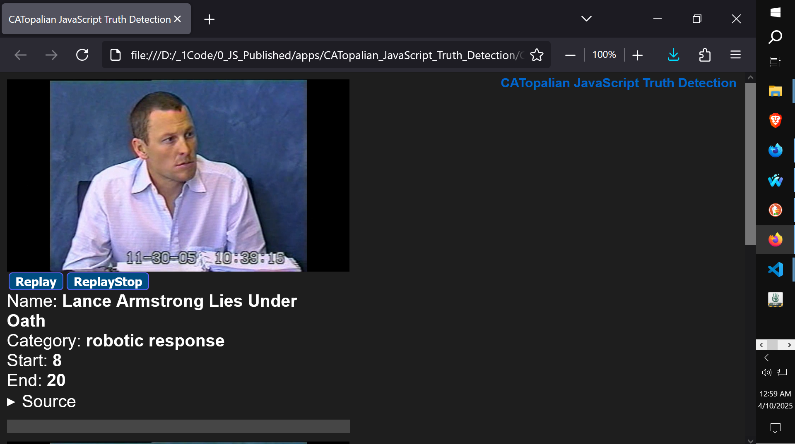

# CATopalian JavaScript Truth Detection
A JavaScript video application that is designed for investigators to closely analyze video interrogations and other video evidence.

---

  

### How to Download this App
1. Click the green Code Button on this github page
2. Choose Download ZIP
3. Save the Zip File
4. Extract All
5. Double click the HTML file to start the App

---

Hapy Scripting :-)